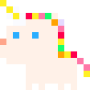

<p align="center">
  
</p>

# Unicorn Console 

[](https://travis-ci.com/Gigoteur/UnicornConsole)
[](https://github.com/Gigoteur/UnicornConsole/blob/master/LICENSE.md)


Unicorn Console (previously known as PX8 in the past, but I think "Unicorn Console" is a better name) is a fantasy engine that let you do quickly any sort of game, application with a default resolution of 128x128 pixels, 8bits color. The console allow you to load what is called a 'cartridge' like in many other fantasy console, that contains the code, the graphics and the sounds.

TOC:
  * [Features](#features)
  * [Pico8 Limitations](#limitations)
  * [Requirements](#requirements)
  * [Download](#download)
    + [Build](#build)
  * [File format](#format)
  * [Examples](#examples)
  * [Create](#create)
  * [API](#api)

The main engine is not dependant of a specific GFX library so you can use it where you want:
  * [unicorn](https://github.com/Gigoteur/UnicornConsole/tree/master/unicorn): Main core engine
  * [unicorn-console](https://github.com/Gigoteur/UnicornConsole/tree/master/unicorn-console): GUI (egui+pixels) implementation to play game !!
  * [unicorn-editor](https://github.com/Gigoteur/UnicornConsole/tree/master/unicorn-editor): Edit GFX, sound of your card

## Features

  * Display: 128x128 pixels by default, 8 bits colors with available list of predefined palettes (16 colors) (pico-8, commodore, atari2600 etc)
  * New 32 bits color could be added directly via the API
  * Font: predefined list of fonts (pico8, bbc, trollmini, etc)
  * Sprites: Single bank of 128 8x8 sprites that is directly from the cartridge
  * Dynamic sprites: create sprites dynamically with the API
  * Code: No limit size in the cartridge, and support of the following languages: lua, python, rhai, wasm
  * Map: 128x32 8-bit cells
  * Sound: 8 channels, tracker, FM synthetizer, 16-bit Wavetables (from GamerCade console) 
  * Editor: GFX and sound editor
  * Network: WIP
  * Screenshot / Gif Recording
  

## Limitations

The console is somewhat compatible with [pico-8](https://www.lexaloffle.com/pico-8.php) (buy it !), most of current functions from pico8 is implemented and the cartridge is the same format. However some pico8/lua language syntax is supported like:
  * compound assignment operators (+=, -=, etc)
  * "!=" like "~="
  * binary literals

But see the unicorn-examples, I did some modifications of good games to use it with Unicorn too.


## Build

Cargo feature:
  * cpython: enable python support
  * rlua: enable lua support

You can build the console directly the main UI to play games:
```
cd unicorn-console
cargo build --release --features=unicorn/cpython,unicorn/rlua
```

You can build the editor the main UI to play games:
```
cd unicorn-editor
cargo build --release
```

## File format

| File format  | Read | Write |
| ------------- | ------------- | ------------- |
| Pico8 PNG  | X  | / |
| Pico8 P8  | X  | X |
| Unicorn (CORN) | X  | X |

Unicorn file format is exactly the same as PICO8 P8 format, except that new sections are available, like __python__, __rhai__, __wasm__, __code__ etc.

## Create

## API

The API is available for Lua/Python.
  * [Graphics](#graphics)
    + [camera](#camera)
    + [circ](#circ)
    + [circfill](#circfill)
    + [clip](#clip)
    + [cls](#cls)
    + [color](#color)
    + [ellipse](#ellipse)
    + [ellipsefill](#ellipsefill)
    + [fget](#fget)
    + [font](#font)
    + [line](#line)
    + [mode](#mode)
    + [pal](#pal)
    + [palt](#palt)
    + [pget](#pget)
    + [print](#print)
    + [pset](#pset)
    + [rect](#rect)
    + [rectfill](#rectfill)
    + [sget](#sget)
    + [spr](#spr)
    + [sset](#sset)
    + [sspr](#sspr)
    + [trigon](#trigon)
  * [MAP](#map)
    + [map](#map)
    + [mget](#mget)
    + [mset](#mset)
  * [Math](#math)
  * [Memory](#memory)
  * [Mouse Input](#mouse_input)
  * [Palettes](#palettes)
  * [Cart Data](#cart_data)

### Graphics

#### camera

`camera([x, y])`

Set the camera position.

* _x_/_y_ are the coordinates to set the camera, and they could be optional (in this case, 0/0 will be used)

#### circ

`circ(x, y, r, [col])`

Draw a circle:
*  _x_/_y_ are the coordinates
* _r_ is the radius of the circle
* _col_ is the color of the circle

#### circfill

`circfill(x, y, r, [col])`

Draw a filled circle:
*  _x_/_y_ are the coordinates
* _r_ is the radius of the circle
* _col_ is the color of the circle

[[https://j.gifs.com/nZl3GE.gif]]

#### clip

`clip([x, y, w, h])`

Set a screen clipping region where:
* x/y are the coordinate
* w is the width
* h is the height

#### cls

Clear the screen.

#### color

`color(col)`

set default color

#### ellipse

`ellipse(x, y, rx, ry, [col])`

Draw an ellipse

#### ellipsefill

`ellipsefill(x, y, rx, ry, [col])`

draw filled ellipse

#### fget

`fget(n, [f])`

get values of sprite flags

#### font

`font(name)`

Change the font policy ("pico8", "bbc", "cbmII", "appleII")

#### fset

`fset(n, [f], v)`

set values of sprite flags

#### line

`line(x0, y0, x1, y1, [col])`

draw line

#### pal

`pal(c0, c1)`

Switch the color c0 to color c1.

#### palt

`palt(col, t)`

Set the transparency for color 'col', where 't' is a boolean

#### pget

`pget(x, y)`

Get the pixel color in x/y coordinate

#### print

`print (str, [x, y, [col]])`
[Python: **unicorn_print**]

Display a string on the screen

#### pset

`pset(x, y, col)`

Set the pixel color with the value 'col' in x/y coordinate

#### rect

`rect(x0, y0, x1, y1, [col])`

draw a rectangle

#### rectfill

`rectfill(x0, y0, x1, y1, [col])`

draw filled rectangle

[[https://j.gifs.com/76MGDr.gif]]

#### sget

`sget(x, y)`

get spritesheet pixel colour

#### spr

`spr(n, x, y, [w, h], [flip_x], [flip_y])`

Draw a sprite:
* _n_ is the sprite number
* _x_/_y_ are the coordinate
* _w_ and _h_ specify how many sprites wide to blit and are 1/1 values by default
* _flip_x_ to flip horizontally the sprite
* _flip_y_ to flip vertically the sprite

Color 0 will be transparent by default (see [palt](https://github.com/Gigoteur/PX8/wiki/API-Documentation#palt)


#### sset

`sset(x, y, [col])`

set spritesheet pixel colour

#### sspr

`sspr(sx, sy, sw, sh, dx, dy, [dw, dh], [flip_x], [flip_y])`

draw texture from spritesheet

#### trigon

`trigon(x1, y1, x2, y2, x3, y3, [col])`

draw trigon

### Keyboard Input

#### btn([i, [p]])

get button i state for player p

#### btnp([i, [p]])

only true when the button was not pressed the last frame; repeats every 4 frames after button held for 15 frames

### Map

#### map

`map(cel_x, cel_y, sx, sy, cel_w, cel_h, [layer])`

[Python: **spr_map**]

Draw map; layers from flags; sprite 0 is empty

#### mget

`mget(x, y)`

Get a map value

#### mset

`mset(x, y, v)`

Set a map value

### Math
### Memory [**WIP**]
### Mouse input [**WIP**]
### Palettes [**WIP**]
### Cart Data [**WIP**]

